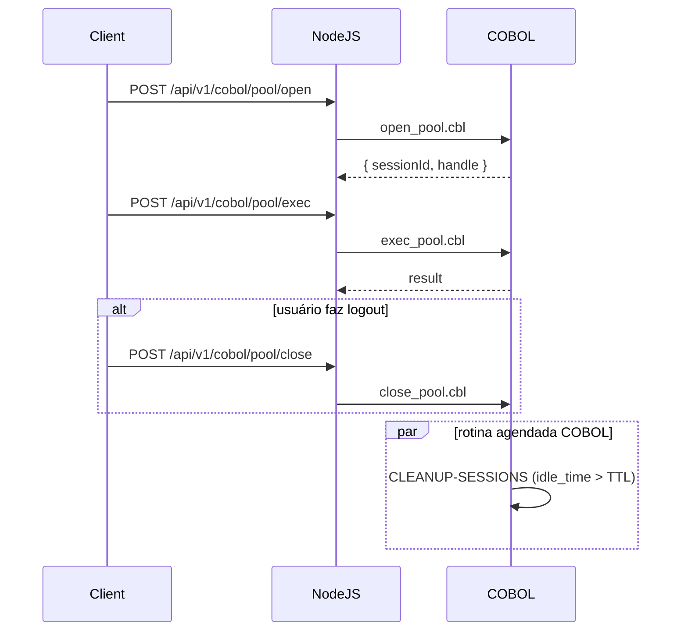

Sua pergunta é sobre a modernização de um sistema bancário em COBOL, com foco em como gerenciar conexões ao banco de dados e instâncias de handle (gerenciamento de conexões/sessões) em um sistema que está sendo escalado para integrar APIs modernas. Você mencionou que o sistema COBOL atual faz regras de negócio e requisições ao banco de dados, com um cenário onde cada requisição cria e encerra uma instância handle. Quer saber se esse cenário é ideal ou se manter a instância aberta durante a sessão do usuário seria melhor, especialmente para controle de requisições, tempo de logon e gerenciamento de sessão. Vamos abordar isso de forma clara, considerando as limitações do COBOL, as práticas modernas e os requisitos de sistemas bancários.

Contexto do Sistema COBOL
Sistemas bancários em COBOL, especialmente em mainframes, são comuns em instituições financeiras, processando grandes volumes de transações com alta confiabilidade. Conforme indicado em fontes como a Reuters, cerca de 43% dos sistemas bancários nos EUA ainda usam COBOL, lidando com 95% das transações de ATM e 80% das transações presenciais. Esses sistemas frequentemente operam com:

Buffers limitados: O COBOL gerencia buffers de entrada/saída (I/O) com tamanhos fixos, o que pode limitar o volume de dados processados por vez. Por exemplo, o gerenciamento de buffers em operações de terminal, como o END LINE TERMINAL SESSION, limpa dados pendentes no buffer.
Regras de negócio embutidas: A lógica de negócio (validações, cálculos, etc.) é implementada diretamente no código COBOL, com chamadas a bancos de dados relacionais (como DB2) ou arquivos ISAM.
Acesso ao banco de dados: Tradicionalmente, o COBOL acessa bancos via SQL embutido (ESQL) ou JDBC em versões mais modernas, com ferramentas como Veryant facilitando a integração sem middleware proprietário.
No seu caso, você já criou uma conexão ao banco de dados e está analisando como o gerenciamento de handles (conexões ou sessões de banco) funciona no COBOL, com cada requisição criando e encerrando uma instância.

Análise do Cenário Atual: Handle por Requisição
No cenário descrito:

Conexão ao banco de dados: Estabelecida para permitir consultas ou transações.
Instância handle por requisição: Cada requisição (ex.: consulta de saldo, transferência) cria uma nova instância de conexão (handle), executa a operação e a encerra.
Vantagens desse modelo (session-per-request):
Isolamento: Cada requisição é independente, reduzindo o risco de conflitos entre transações concorrentes. Isso é ideal para sistemas bancários, onde a consistência de dados é crítica.
Escalabilidade: Não mantém conexões abertas desnecessariamente, liberando recursos do banco de dados após cada operação. Isso é importante em sistemas com milhares de usuários simultâneos, como destacado em discussões sobre conexão com bancos como PostgreSQL.
Simplicidade: Não exige gerenciamento de estado de sessão no COBOL, que pode ser complexo devido às limitações de buffer e à natureza estática da linguagem.
Desvantagens:
Overhead de conexão: Criar e encerrar uma conexão para cada requisição consome tempo e recursos, especialmente em bancos relacionais como DB2 ou Oracle, onde estabelecer uma conexão pode ser custoso (ex.: até 1,3 MB de memória por conexão em PostgreSQL).
Latência: O tempo de abertura/fechamento de conexões pode aumentar a latência, impactando a experiência do usuário em operações frequentes.
Falta de persistência de sessão: Não mantém estado entre requisições, o que pode ser um problema se o sistema bancário precisa rastrear a sessão do usuário (ex.: tempo de logon, sequência de ações).
Alternativa: Manter Instância Aberta Durante a Sessão (Session Persistence)
Nesse modelo, a instância handle (conexão ao banco) é mantida aberta enquanto o usuário está logado no sistema bancário, permitindo controle de sessão e requisições contínuas.

Vantagens:
Menor overhead: Reutilizar a mesma conexão elimina o custo de abrir/fechar conexões repetidamente, reduzindo latência.
Controle de sessão: Permite rastrear tempo de logon e ações do usuário.
Integração com APIs modernas: Alinha com o uso de tokens JWT para autenticação.

Desvantagens:
Consumo de recursos: Conexões abertas podem esgotar recursos do banco.
Complexidade no COBOL: Exige middleware ou JDBC para persistência.
Risco de vazamentos: Sessões não fechadas corretamente podem causar leaks.

Abordagem Recomendada: Session-per-Request com Connection Pooling
Nesse modelo, cada requisição retira uma conexão de um pool compartilhado e a devolve ao final, garantindo isolamento, alta performance e escalabilidade sem manter sessões de conexão por usuário.

Vantagens:
Eficiência: O pool mantém conexões ativas e reutilizáveis, reduzindo overhead de abrir/fechar conexões.
Escalabilidade: Limita o número de conexões simultâneas ao máximo configurado, evitando esgotar recursos.
Integração com JWT: Cada requisição é autenticada via JWT, e o pool gerencia conexões sem expor handles ao cliente.

Desvantagens:
Configuração adicional: É preciso ajustar parâmetros do pool (tamanho máximo, idle timeout) e monitorar seu comportamento.
Gerenciamento de idle timeout: Sessões ociosas são encerradas automaticamente, requerendo coordenação com o TTL do JWT.

Exemplo de uso em Node.js:
```javascript
const client = await pool.connect();
try {
  const result = await client.query('SELECT saldo()');
  return result.rows[0].saldo;
} finally {
  client.release();
}
```

Qual é o Cenário Ideal?
O modelo ideal depende dos requisitos do seu sistema bancário, mas, com base nas práticas modernas e nas limitações do COBOL, a abordagem híbrida com connection pooling é geralmente recomendada para sistemas bancários modernizados. Aqui está uma análise detalhada:

1. Por que Connection Pooling?
Eficiência: Um connection pool mantém um conjunto de conexões abertas que podem ser reutilizadas por várias requisições, reduzindo o overhead de abrir/fechar conexões.
Escalabilidade: Permite lidar com milhares de usuários simultâneos, comum em sistemas bancários, sem esgotar os recursos do banco de dados.
Compatibilidade com COBOL: Ferramentas como Veryant permitem acesso a bancos relacionais via JDBC, que suporta connection pooling sem grandes mudanças no código COBOL.
Integração com APIs modernas: APIs RESTful ou SOAP frequentemente assumem conexões persistentes para autenticação e rastreamento de sessão, e o connection pooling facilita essa integração.
2. Como Implementar no Seu Caso?
2.1 Configurar Connection Pool no Node.js
- Instalar e configurar o cliente 'pg' (ou biblioteca equivalente).
- Criar módulo em src/config/dbPool.js com parâmetros (max, idleTimeout, connectionString via .env).
- Importar e reutilizar pool em todos os services.

2.2 Autenticação e Autorização (JWT)
- Implementar rota POST /login que emite token JWT com expiresIn definido.
- Criar middleware em src/middleware/auth.js para validar token e popular req.user.
- Configurar secret e TTL no arquivo .env.

2.3 Adaptação dos Serviços COBOL
- Remover instruções CONNECT/DISCONNECT dos programas COBOL (.cbl) para transferir controle de conexões ao backend.
- Criar executor em src/utils/cobolExecutor.js que invoca cobol-compile.sh, passando parâmetros de entrada.
- No service (e.g., src/api/services/balanceService.js), chamar executor:
  const result = await cobolExecutor('SALDO', { userId });

2.4 Fluxo de Requisição
- Frontend envia o JWT no header Authorization: Bearer <token>.
- Middleware auth valida o token, extrai userId e adiciona req.user.
- Handler puxa conexão do pool:
  const client = await pool.connect();
  try {
    // chamada SQL ou executor COBOL via client
  } finally {
    client.release();
  }
- O executor roda o programa COBOL e retorna resultado JSON ao handler.

2.5 Plano de Testes de Integração
- Criar unit tests para services e middleware usando mocks de pool e cobolExecutor.
- Implementar testes end-to-end que acionam o endpoint e executam programas COBOL reais.
- Validar cenários de idleTimeout do pool e expiração do JWT.

2.6 Controle de Conexões Estritamente no COBOL (Pool Gerenciado pelo COBOL)
Neste cenário, o COBOL mantém o pool de conexões internamente e expõe três operações (open, exec, close) que o intermediário JavaScript consome.

2.6.1 Abrir Pool
- Frontend/JS faz POST /api/v1/cobol/pool/open com { userId }.
- COBOL (open_pool.cbl):
  * Lê SESSION-ID do corpo da requisição.
  * EXEC SQL CONNECT :USERNAME IDENTIFIED BY :PASSWD USING :DBNAME AS :HANDLE END-EXEC.
  * Armazena (SESSION-ID, HANDLE) em tabela temporária em memória ou arquivo.
  * Retorna JSON: { sessionId, handle }.

2.6.2 Execução de Requisições
- JS faz POST /api/v1/cobol/pool/exec com { sessionId, operation, params }.
- COBOL (exec_pool.cbl):
  * Recupera HANDLE a partir de SESSION-ID.
  * EXEC SQL SET CONNECTION :HANDLE END-EXEC.
  * EXEC SQL <operation> USING :params INTO :result END-EXEC.
  * Retorna JSON com resultado.

2.6.3 Fechar Pool
- JS faz POST /api/v1/cobol/pool/close com { sessionId }.
- COBOL (close_pool.cbl):
  * Busca HANDLE por SESSION-ID.
  * EXEC SQL DISCONNECT :HANDLE END-EXEC.
  * Remove registro da tabela de sessões.
  * Retorna status success.

2.6.4 Timeout e Limpeza Automática
- COBOL monitora tempo de inatividade por SESSION-ID.
- Se idle > TTL configurado, executa DISCONNECT e limpa a sessão automaticamente.
- Em cada operação (open, exec) ou em rotina agendada de limpeza, o COBOL realiza:
  1. EXEC SQL SELECT last_activity, dbhandle INTO :WS-LAST-ACT, :WS-HANDLE
     FROM session_pool WHERE session_id = :WS-SESSION-ID END-EXEC.
  2. Calcula diferença: `idle_time = CURRENT_TIMESTAMP - WS-LAST-ACT`.
  3. Se `idle_time > TTL` (ex.: 15 minutos):
     a. EXEC SQL DISCONNECT :WS-HANDLE END-EXEC.
     b. EXEC SQL DELETE FROM session_pool WHERE session_id = :WS-SESSION-ID END-EXEC.
     c. Retornar erro de 'sessão expirada' ao JS.
  4. Caso contrário, prossegue e atualiza a atividade:
     /EXEC SQL UPDATE session_pool SET last_activity = CURRENT_TIMESTAMP
         WHERE session_id = :WS-SESSION-ID END-EXEC.

- Exemplo de pseudocódigo COBOL para limpeza agendada:
```cobol
    PERFORM CLEANUP-SESSIONS.
    STOP RUN.

CLEANUP-SESSIONS.
    EXEC SQL
      DECLARE stale CURSOR FOR
        SELECT session_id, dbhandle
        FROM session_pool
        WHERE last_activity < CURRENT_TIMESTAMP - INTERVAL '15' MINUTE
    END-EXEC.
    EXEC SQL OPEN stale END-EXEC.
    PERFORM FETCH-LOOP UNTIL SQLCODE NOT = ZERO
      EXEC SQL FETCH stale INTO :WS-SESSION-ID, :WS-HANDLE END-EXEC
      IF SQLCODE = ZERO
        EXEC SQL DISCONNECT :WS-HANDLE END-EXEC
        EXEC SQL DELETE FROM session_pool WHERE session_id = :WS-SESSION-ID END-EXEC
      END-IF
    END-PERFORM.
    EXEC SQL CLOSE stale END-EXEC.
```

2.6.5 Fluxo de Operações (Sequence Diagram)


3. Cenário Ideal: Session-per-Request com Connection Pooling
Por que? Combina o isolamento do modelo session-per-request (cada requisição é independente) com a eficiência de reutilizar conexões via connection pooling. Isso evita o overhead de conexões novas sem manter instâncias abertas por usuário, reduzindo riscos de session leaks.
Como funciona?
Um connection pool mantém conexões abertas no servidor.
Cada requisição COBOL solicita uma conexão do pool, executa a transação e devolve a conexão ao pool.
A sessão do usuário é gerenciada separadamente (ex.: via cookies ou tokens), não dependendo da conexão ao banco.
Exemplo em COBOL:
cobol

Copy
EXEC SQL
    CONNECT TO 'DATABASE' AS 'DB1' USER 'USER' USING 'PASSWORD'
END-EXEC.
* Lógica de negócio
EXEC SQL
    SELECT BALANCE INTO :BALANCE FROM ACCOUNTS WHERE ID = :ID
END-EXEC.
* Devolver conexão ao pool (gerenciado pelo middleware)
EXEC SQL
    DISCONNECT 'DB1'
END-EXEC.
Aqui, o middleware (ex.: CICS ou WebSphere) gerencia o connection pool, e o COBOL apenas faz chamadas SQL.
4. Gerenciamento de Sessão no COBOL
Controle de logon e sessão: Em sistemas bancários, rastrear a sessão do usuário (ex.: tempo de logon, histórico de ações) é essencial para segurança e auditoria. No COBOL, isso pode ser feito:
Cookies ou tokens: Armazene um ID de sessão em um cookie ou token JWT, enviado com cada requisição, como em ASP.NET Core.
Cache de sessão: Use um sistema como Redis ou WebLogic para armazenar dados de sessão (ex.: ID do usuário, tempo de logon), acessível por todas as instâncias COBOL.
Limitação do COBOL: Como o COBOL não é projetado para gerenciar sessões complexas, delegue isso a um middleware moderno, mantendo o COBOL focado na lógica de negócio.
Exemplo de integração:
Configure o WebSphere para gerenciar sessões persistentes com JDBC-based persistence, que é mais robusta para sistemas bancários, embora mais lenta que replicação em memória.
O COBOL faz chamadas ao banco via JDBC, enquanto o WebSphere rastreia a sessão do usuário.
Recomendações para Modernização
Adote Connection Pooling:
Configure um connection pool no ambiente do mainframe ou em um middleware (ex.: pgpool-II, WebSphere).
Isso reduz o overhead de conexões e suporta o alto volume de transações típico de sistemas bancários.
Mantenha Session-per-Request para Lógica de Negócio:
Continue criando/encerrando handles lógicos por requisição no COBOL, mas use o connection pool para gerenciar conexões físicas ao banco.
Isso garante isolamento e escalabilidade, alinhado com o modelo Hibernate descrito para aplicações multiusuário.
Gerencie Sessões Fora do COBOL:
Use um middleware (ex.: WebLogic, ASP.NET Core) para rastrear sessões de usuários via cookies, tokens ou cache distribuído (Redis).
O COBOL deve focar na lógica de negócio e chamadas ao banco, delegando o gerenciamento de sessão a sistemas modernos.
Integre APIs Modernas:
Exponha a lógica COBOL como endpoints RESTful usando ferramentas como IBM Z/Series ou Veryant, permitindo integração com sistemas externos.
Atualize a interface do usuário para tecnologias web modernas (ex.: Angular, React), conectando-as às APIs REST.
Considere Limitações do COBOL:
Buffers limitados podem restringir o volume de dados por requisição. Use middleware para gerenciar grandes volumes de dados antes de passar ao COBOL.
A escassez de programadores COBOL (média de idade 45-55 anos) pode dificultar manutenção; invista em documentação e treinamento.
Resposta Final
O cenário atual (handle por requisição) é funcional, mas não ideal devido ao overhead de criar/encerrar conexões, especialmente em sistemas bancários com alto volume de transações. A abordagem ideal é adotar o modelo session-per-request com connection pooling:

Como funciona: Cada requisição COBOL usa uma conexão do pool, executa a transação e devolve a conexão, mantendo isolamento e eficiência.
Gerenciamento de sessão: Delegue o controle de logon e sessão (ex.: tempo de logon, auditoria) a um middleware moderno (WebLogic, Redis), usando cookies ou tokens, enquanto o COBOL foca na lógica de negócio.
Modernização: Integre APIs RESTful para conectar o COBOL a sistemas externos, use middleware para connection pooling e atualize a interface para tecnologias web.
Essa abordagem combina a confiabilidade do COBOL com práticas modernas, garantindo escalabilidade, segurança e integração com APIs. Se precisar de ajuda com a implementação (ex.: configuração de connection pool ou APIs), posso fornecer exemplos mais específicos!

2.6.4 Timeout e Limpeza Automática
- COBOL monitora tempo de inatividade por SESSION-ID.
- Se idle > TTL configurado, executa DISCONNECT e limpa a sessão automaticamente.
- Em complemento, o Node.js/JS deve chamar `/api/v1/cobol/pool/close` ao logout ou expiração do JWT, encerrando sessões proativamente.
- O COBOL mantém o TTL interno como fallback caso o `close` não seja invocado pelo cliente.