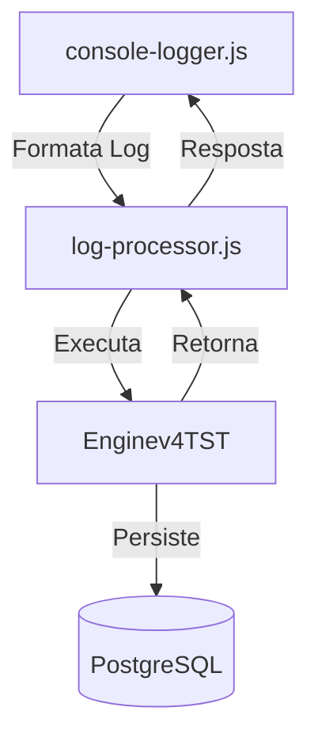

# 📝 CobolBank: Sistema de Logging e Integração

## 🎯 Visão Geral

O sistema de logging do CobolBank é uma solução integrada que combina tecnologias modernas com sistemas COBOL legados, projetado para rastrear todas as operações do sistema, desde o frontend até as operações COBOL, com persistência em banco de dados PostgreSQL.

## 🏗️ Estrutura do Sistema

### Organização de Arquivos
```
Rules/api/
├── cobol/
│   ├── DEV/
│   │   └── bin/
│   │       └── Enginev4TST    # Executável COBOL para BD
│   └── processor/
│       └── log-processor.js   # Interface Node.js com COBOL
└── utils/
    └── logger/
        ├── config.js          # Configurações centralizadas
        ├── console-logger.js  # Interface de logging
        └── index.js          # Exportações do módulo
```

### Fluxo de Dados


## 📊 Componentes do Sistema

### 1. Console Logger (`console-logger.js`)
- Interface principal de logging
- Formatação de mensagens para console
- Preparação de dados para processamento
- Validação inicial de dados

```javascript
// Exemplo de uso
logger.logInfo('Operação iniciada');
logger.logRequest(req);
logger.logResponse(req, res, data);
logger.logError(error);
logger.logCobol('OPERATION_NAME', data);
```

### 2. Log Processor (`log-processor.js`)
- Interface com executável COBOL
- Formatação de dados para COBOL
- Gerenciamento de processos
- Tratamento de respostas

```javascript
// Formato de dados para COBOL
const logData = {
    session_id: string(10),    // ID único da sessão
    component: string(10),     // FRONTEND, BACKEND, COBOL
    action: string(10),        // Ação realizada
    status: string(10),        // OK, ERROR, PENDING
    response_time: number,     // Tempo de resposta em ms
    message: string(100),      // Mensagem descritiva
    endpoint: string(30),      // Endpoint acessado
    method: string(10),        // Método HTTP
    value: number(12,2)       // Valor processado
};
```

### 3. COBOL Engine (`Enginev4TST`)
- Processamento de dados
- Persistência no PostgreSQL
- Validações de negócio
- Respostas padronizadas

## ⚙️ Configuração

### Estrutura de Configuração (`config.js`)
```javascript
module.exports = {
    console: {
        colors: {
            REQUEST: '\x1b[36m',  // Cyan
            RESPONSE: '\x1b[32m', // Green
            ERROR: '\x1b[31m',    // Red
            WARN: '\x1b[33m',     // Yellow
            INFO: '\x1b[34m',     // Blue
            COBOL: '\x1b[35m',    // Magenta
            RESET: '\x1b[0m'
        },
        icons: {
            REQUEST: '→',
            RESPONSE: '←',
            ERROR: '✖',
            WARN: '⚠',
            INFO: 'ℹ',
            COBOL: '⚙'
        }
    },
    database: {
        host: process.env.DB_HOST || 'localhost',
        port: process.env.DB_PORT || 5432,
        name: process.env.DB_NAME || 'cobolbd',
        table: process.env.DB_TABLE || 'log_cobol_test'
    },
    validation: {
        maxLengths: {
            session_id: 10,
            component: 10,
            action: 10,
            status: 10,
            message: 100,
            endpoint: 30,
            method: 10,
            value: 12
        }
    },
    filters: {
        ignoreStaticRequests: true,
        staticPatterns: [
            /\.(js|css|png|jpg|jpeg|gif|ico|svg|woff|woff2|ttf|eot)$/i,
            /^\/assets\//,
            /^\/static\//,
            /^\/images\//,
            /^\/fonts\//
        ]
    }
};
```

### Banco de Dados
```sql
CREATE TABLE log_cobol_test (
    id SERIAL PRIMARY KEY,
    session_id VARCHAR(10),
    response_time INTEGER,
    value_processed DECIMAL(10,2),
    component VARCHAR(10),
    action VARCHAR(10),
    status VARCHAR(10),
    message VARCHAR(100),
    endpoint VARCHAR(30),
    method VARCHAR(10),
    created_at TIMESTAMP DEFAULT CURRENT_TIMESTAMP
);
```

## 🔍 Monitoramento

### Console Output
```bash
→ [10:15:30] GET /api/users
  Query: { "filter": "active" }
← [10:15:31] 200 GET /api/users (120ms)
  Response: { "count": 5, "users": [...] }
```

### Logs Persistidos
- Consulta via PostgreSQL
- Filtros por sessão, componente, status
- Análise de performance
- Rastreamento de erros

## 🛠️ Boas Práticas

### 1. Logging
- Use níveis apropriados (INFO, WARN, ERROR)
- Inclua contexto relevante
- Evite dados sensíveis
- Mantenha mensagens consistentes

### 2. Performance
- Validação antes do processamento
- Formatação eficiente
- Controle de buffer
- Limpeza periódica

### 3. Manutenção
- Monitoramento de erros
- Backup de logs
- Rotação de arquivos
- Limpeza automática

## 📚 Referências

- [Documentação da API](./api/GUIDE-API.md)
- [Guia de Desenvolvimento](../Rules/api/cobol/DEV/TODO-LOG.md)
- [Documentação do PostgreSQL](https://www.postgresql.org/docs/)
- [Node.js Child Process](https://nodejs.org/api/child_process.html)
- [COBOL File Handling](https://www.ibm.com/docs/en/cobol-zos)

---

*Este documento é um guia completo do sistema de logging do CobolBank, refletindo sua arquitetura simplificada e fluxo direto de processamento.* 